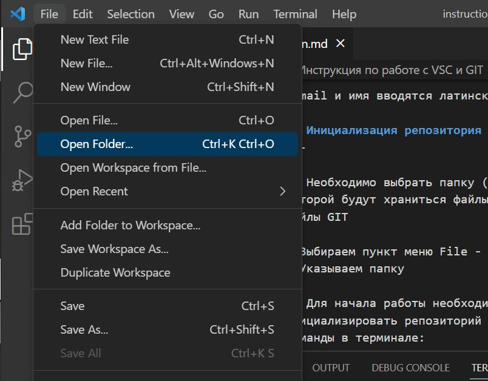

# Инструкция по работе с VSC и GIT

## Установка программ
---

* Для установки программы GIT необходимо пройти по ссылке ниже

[GIT Install](https://git-scm.com/book/en/v2/Getting-Started-Installing-Git)

* Для установки программы VSC необходимо пройти по ссылке ниже

[VSC Install](https://code.visualstudio.com)

* Запустить программу VSC

* Запустить терминал

* Представиться GITу

В терминале ввести две команды знакомства:

> git config --global user.email "ВАШ email"

> git config --global user.name "ВАШЕ Имя"

E-mail и имя вводятся латинскими буквами

## Инициализация репозитория
---

1. Необходимо выбрать папку (репозиторий), в которой будут храниться файлы по проекту и файлы GIT

* Выбираем пункт меню File -  Open folder..

* Указываем папку

2. Для начала работы необходимо инициализировать репозиторий с помощью ввода команды в терминале:

>git init

В результате командая строка вернет сообщение "Initialized empty Git repository in...", то есть произведена инициализация пустого репозитория в текущей папке

## Основные команды
---

| Комнада | Значение |
| ------ | ------ |
| git --version | Версия присоединенного GIT |
| git status | Проверка статуса репозитория |
| git add | Добавление отдельных файлов или всех файлов в область подготовленных файлов
| git commit -m "..." | Внесение изменений однострочным сообщением или через редактор. Вместо троеточия указывается сообщение |
| git log | Просмотр истории коммитов с изменениями. Вывод значений постранично, для выхода из режима просмотра в самом конце на значении END нажать клавишу Q |
| git diff | Просмотр изменений до коммита |
| git checkout | Отмена подготовленных и неподготовленных изменений. С параметром *master* - возвращение в самое актуальное состояние |

## Синтаксис MarkDown
---

*Курсив*

**Полужирный**

~~Зачеркнутый~~

# Заголовок

## Подзаголовок

* Первый элемент
* Второй элемент

1. Первый элемент
2. Второй элемент